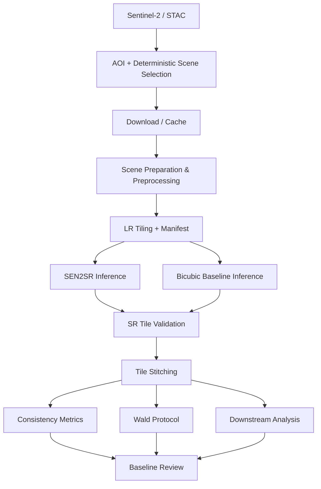

# ZoomedEarth

ZoomedEarth is a Sentinel-2 super-resolution project focused on producing and evaluating higher-resolution imagery from Sentinel-2 observations. It takes standard 10 m RGB+NIR Sentinel-2 L2A images and generates a 2.5 m (4×) super-resolved product. 

Rather than focusing solely on training a new architecture, ZoomedEarth is a **validation and trust harness** designed to evaluate super-resolution reliability over Indian geographies using pre-trained models.

---

## 1. Project Overview

Sentinel-2 imagery provides exceptional global coverage, but its 10 m spatial resolution is too coarse for fine-grained urban and disaster analysis (such as building-level detection). ZoomedEarth addresses this limitation by applying deep learning to super-resolve Sentinel-2 imagery to 2.5 m.

However, super-resolution models pose a core risk: they can "invent" plausible but fake details (hallucinations). Analysts require evidence of when to trust the output. ZoomedEarth provides this trust harness through rigorous evaluation protocols, quantitative consistency gates, uncertainty mapping, and empirical validation on downstream tasks.

---

## 2. Problem Statement

### Input Problem
Sentinel-2 L2A optical bands (RGB + NIR) are captured at a native resolution of 10 m/pixel.

### Technical Problem
Generating a 2.5 m resolution image requires a 4× spatial upsampling that preserves geospatial alignment, radiometric characteristics, and structural fidelity without introducing artifacts.

### Scientific Problem
Producing a visually sharper image is not sufficient. An AI model can hallucinate realistic-looking structures that do not exist. Therefore, producing SR imagery must be coupled with rigorous scientific validation, consistency sanity gates (ensuring the 2.5 m image downsampled back to 10 m matches the original), and uncertainty calibration.

---

## 3. Objectives

- **G1**: 4× SR of Sentinel-2 L2A B02/B03/B04/B08 → 2.5 m, georeferenced COG. (Base: pretrained `SEN2SR`).
- **G2**: Consistency as a **sanity gate** (SR↓10 m ≈ input). 
- **G3**: Per-pixel uncertainty raster with every SR output, plus calibration evidence.
- **G4**: Validation in three tiers, reported separately and never blended:
  - **Tier A**: Real 10 m → 2.5 m HR pairs.
  - **Tier B**: India Wald protocol (40 m → 10 m).
  - **Tier C**: Downstream building detection on India AOIs.
- **G5**: Offline demo on Indian AOIs from cached outputs.

---

## 4. System Architecture



- **STAC Discovery**: Identifies optimal Sentinel-2 L2A scenes via Earth Search.
- **Scene Preparation**: Downloads bands, handles BOA reflectance offsets, and masks clouds using SCL.
- **Tiling**: Chips the 10 m scene into 128×128 pixel tiles to satisfy memory and model constraints.
- **Inference**: Runs tiles through the `SEN2SRLite` and `Bicubic` models.
- **Stitching**: Recombines the 2.5 m output tiles into a full GeoTIFF scene.
- **Metrics (Sanity Gate)**: Downsamples the 2.5 m scene to 10 m and computes RMSE and Spectral Angle Mapper (SAM) against the input.
- **Wald & Downstream (Planned)**: Scientifically evaluates the SR outputs on downstream tasks.

---

## 5. End-to-End Pipeline

1. **Ingest & Preprocess**: 
   - *Input*: STAC Item ID.
   - *Processing*: Downloads B02, B03, B04, B08, and SCL. Applies proper reflectance scaling and processing-baseline offset corrections.
   - *Output*: Prepared 10 m GeoTIFFs.
2. **Tiling**: 
   - *Input*: Prepared 10 m scene.
   - *Processing*: Splits the scene into 128×128 tiles with overlap.
   - *Output*: Tile directories containing `B02.tif`, `B03.tif`, `B04.tif`, `B08.tif`.
3. **Inference**:
   - *Input*: 128×128 tiles in canonical order.
   - *Processing*: Applies SEN2SRLite model (converting to model band order internally). FP32 precision.
   - *Output*: 512×512 super-resolved tiles.
4. **Stitching**:
   - *Input*: 512×512 tiles.
   - *Processing*: Feathers and merges overlapping tiles into a cohesive raster.
   - *Output*: `SEN2SR_scene.tif` (2.5 m).
5. **Consistency Metrics**:
   - *Input*: `SEN2SR_scene.tif` and the 10 m original scene.
   - *Processing*: Downsamples SR back to 10 m and measures deviations.
   - *Output*: JSON metrics (RMSE, SAM, Rel Error).

---

## 6. Data and AOI Strategy

- **Source**: Sentinel-2 L2A (AWS Earth Search).
- **Canonical Band Order**: `[B02, B03, B04, B08]` is strictly enforced throughout the data pipeline and storage.
- **Reflectance**: Digital Numbers (DN) are converted to surface reflectance (0-1), actively respecting ESA's shifting processing baseline offsets (e.g., `-1000` offset applied correctly).
- **Cloud Masking**: Leverages the Scene Classification Layer (SCL) to exclude clouds/shadows from evaluation.

---

## 7. Models and Baselines

### SEN2SRLite
- **Role**: Primary super-resolution model.
- **Model**: `SEN2SRLite` (`NonReference_RGBN_x4`). Pretrained weights are used (CC0 1.0 license; code MIT).
- **Constraints**: 
  - **Band Order**: The model expects `[B04, B03, B02, B08]`. The pipeline dynamically permutes our canonical `[B02, B03, B04, B08]` before inference and reverses it after.
  - **Precision**: Inference runs strictly in **FP32**. FP16 is explicitly disabled because it causes NaNs in the NIR band on RTX 3050 GPUs due to unsupported `ComplexHalf` operations in the model's HardConstraint layer.
  - **Input Size**: The model's Fourier layers require exactly 128×128 inputs.

### Bicubic Baseline
- **Role**: The classical 4× upsampling baseline.
- **Implementation**: Uses `rasterio` and `Affine` transforms for georeference-aware resampling.

---

## 8. Implementation Status

### Phase 1 — OpenSR baseline
| Task | Status |
|---|---|
| T1.1 SEN2SR reproduction | ✅ Complete |
| T1.2 Bicubic baseline | ✅ Complete |
| T1.3 Speed / VRAM | ✅ Complete |
| **Gate 1** | ✅ **Complete** |

### Phase 2 — Data ingest
| Task | Status |
|---|---|
| T2.1 STAC + preprocessing | ✅ Complete |
| T2.2 AOI + deterministic scene | ✅ Complete |
| T2.3 Download/cache | ✅ Complete |
| T2.4 Scene preparation | ✅ Complete |
| T2.5 LR tiling + manifest | ✅ Complete |
| T2.6 SEN2SR tile inference | ✅ Complete |
| T2.7 | ✅ Complete |
| T2.8 SR tile stitching | ✅ Complete |
| **Gate 2** | ✅ **Complete** |

**RAD-2b Corrective Hardening** (Completed):
Dynamically enforced the band-order contract across the entire inference path. Fixed `128×128` routing, contiguous GeoTIFF writes, real-model equivalence tests, and FP32-only deterministic comparison. **139 tests passing.**

### Phase 3 — Metrics + Baselines
| Task | Status |
|---|---|
| T3.1 Consistency metrics | ✅ Complete |
| T3.2 Wald-protocol set | ⬜ Planned |
| T3.3 Baseline review / decision | ⬜ Planned |
| **Gate 3** | ⬜ **Planned** |

---

## 9. Evaluation Methodology

The project's evaluation is governed by `docs/EVAL_PROTOCOL.md`. 
- **Tier E (Consistency)**: The Sanity Gate. SR outputs downsampled back to 10 m via a 4×4 box-average kernel must radiometrically match the 10 m input. We report per-band RMSE, Global RMSE, and Spectral Angle Mapper (SAM). 
- **Tier A (Real HR)**: Compare SR against real 2.5 m reference data (NAIP/SPOT) using PSNR, SSIM, LPIPS.
- **Tier C (Downstream)**: Test building detection performance on India AOIs using a U-Net. Compare building F1 scores of SR vs. Bicubic using block-bootstrap confidence intervals.

**Note**: Scientific evaluation is currently in progress and no final T3.x conclusions are claimed yet. T3.1 (Consistency) is implemented, but Tiers A-D are planned.

---

## 10. Reproducibility / Quick Start

**OS**: Native Linux (GPU workflows).  
**Env**: Python 3.10+, PyTorch 2.3.0+cu121.

### Run Tests
```bash
python -m pytest tests/
```

### Run Pipeline
The pipeline requires a valid STAC item ID (e.g., `S2B_43RFM_20230203_0_L2A`):
```bash
# 1. Prepare scene
python src/ingest/prepare_scene.py --item-id <ITEM_ID>

# 2. Tile scene
python src/ingest/tile_scene.py --item-id <ITEM_ID>

# 3. Infer tile
python src/infer/infer_tile.py --tile-dir <PATH_TO_TILE> --output-dir <OUT_DIR> --device cuda:0

# 4. Stitch scene
python src/infer/stitch.py --item-id <ITEM_ID> --tiles-dir <TILES_DIR> --output-raster <OUT.tif>
```

### Run Evaluation (T3.1 Consistency)
```bash
python src/eval/consistency.py --lr-dir <PATH_TO_LR_SCENE> --sr-raster <PATH_TO_SR_SCENE.tif>
```

---

## 11. Hardware and Performance

**Measured Project Results** (from T1.3 benchmark):
- **GPU**: NVIDIA GeForce RTX 3050 6GB Laptop GPU
- **CUDA/PyTorch**: CUDA 12.1, PyTorch 2.3.0+cu121
- **Precision**: FP32 (FP16 produces NaNs on this hardware)
- **Input Size**: 128×128 (4 channels)
- **Output Size**: 512×512 (4 channels)
- **Latency**: ~9.0 ms per tile inference
- **Peak VRAM**: ~159 MB per tile

---

## 12. Repository Structure

```text
.
├── configs/             # AOI and tiling configurations
├── data/                # Data storage (git-ignored)
├── docs/                # Project documentation (PRD, TRD, Protocol, Decisions)
├── models/              # Pretrained model weights
├── outputs/             # Benchmark and experiment outputs
├── scripts/             # Diagnostic and utility scripts
├── src/                 
│   ├── eval/            # Metrics and evaluation scripts
│   ├── infer/           # SR inference, bicubic, stitching, benchmarking
│   └── ingest/          # STAC fetching, preprocessing, tiling
├── tests/               # Pytest suite (139 tests)
├── DECISIONS.md         # Architecture and design decision log
└── README.md            # This file
```

---

## 13. Key Engineering Decisions

- **D001**: Use pretrained `SEN2SRLite` (`NonReference_RGBN_x4`) as primary baseline model.
- **D003**: FP16 disabled for inference due to experimental `ComplexHalf` NaN generation on the RTX 3050.
- **D004**: Explicit bidirectional permutation `[B02,B03,B04,B08]` ↔ `[B04,B03,B02,B08]` across the model wrapper boundary.
- **D008**: Reflectance offset from `s2:processing_baseline` is strictly enforced. Scenes causing >5% negative pixels are quarantined.

For the full log, see [DECISIONS.md](docs/DECISIONS.md).

---

## 14. Validation and Testing

### Engineering Validation
The repository contains 139 passing tests validating:
- STAC downloading and metadata parsing.
- Correct BOA reflectance conversions and offsets.
- Spatial coordinate consistency, affine transforms, and tiling alignment.
- Geotiff writing (contiguous arrays).
- SEN2SRLite model equivalence (ensuring the model outputs match despite band permutation).
- Consistency metric algorithms (downsampling kernels and spectral angle math).

### Scientific Validation
Scientific validation is distinct from engineering validation. It relies on the protocols in `EVAL_PROTOCOL.md` and is currently underway in Phase 3.

---

## 15. Results and Evidence

### Engineering Results
- **Inference Equivalence**: The band-order permutation wrapper was proven numerically equivalent to direct model execution (FP32).
- **VRAM Constraints**: The pipeline operates comfortably within a 6GB VRAM budget by processing the scene in 128×128 tiles.

### Scientific Results
**Scientific evaluation is currently in progress and no final T3.x conclusions are claimed yet.**
T3.1 (Consistency) is implemented and was successfully used to detect and quarantine an improperly prepared scene (flagging ~4.4 degrees of Spectral Angle deviation when band orders were corrupted).

---

## 16. Limitations

- **HR Reference**: There is a lack of true high-resolution reference data for India. Tier A evaluates on non-Indian datasets (e.g. NAIP).
- **Wald Proxy**: Tier B relies on a 40 m → 10 m Wald downsampling protocol, which trains/evaluates on the wrong physical scale.
- **Downstream Labels**: Tier C relies on Open Buildings or OSM footprints which may be noisy or misaligned to Sentinel-2 grids.
- **Hallucinations**: Without explicit uncertainty masking, the SR model can synthesize textures that look realistic but are physically incorrect.
- **Monsoon Cloud**: Optical data is limited during monsoons; this project processes dry-season or clear-sky scenes only.

---

## 17. Roadmap

- ✅ **Phase 1**: OpenSR baseline
- ✅ **Phase 2**: Data ingest & Tiling pipeline
- ✅ **Phase 3 (T3.1)**: Consistency metrics
- 🔄 **Phase 3 (T3.2)**: Wald-protocol set
- ⬜ **Phase 3 (T3.3)**: Baseline review / decision
- ⬜ **Phase 4**: Uncertainty mapping
- ⬜ **Phase 5**: Downstream analysis

---

## 18. Documentation

- [Product Requirements Document (PRD)](docs/PRD.md)
- [Technical Requirements Document (TRD)](docs/TRD.md)
- [Evaluation Protocol](docs/EVAL_PROTOCOL.md)
- [Decisions Log](docs/DECISIONS.md)

---

## 19. Evaluator Quick Start

*I have just received this repository. What should I do?*

1. Read this README.
2. Read `docs/PRD.md` to understand the problem space.
3. Read `docs/EVAL_PROTOCOL.md` to understand the scientific rigor.
4. Review `docs/DECISIONS.md` to see the engineering constraints encountered.
5. Set up your Python 3.10+ environment and PyTorch 2.x installation.
6. Run the test suite: `python -m pytest tests/`
7. Run the pipeline stages (`prepare_scene.py`, `tile_scene.py`, `infer_tile.py`, `stitch.py`) on a test item.
8. Review the consistency metrics using `src/eval/consistency.py`.
9. Compare implementation status against the roadmap above.

---

## 20. Scientific Honesty

In ZoomedEarth, **super-resolution output is not automatically ground truth**. Visual sharpness is not sufficient evidence of success. Evaluation must respect the available reference information, and engineering correctness (e.g., code runs without crashing) does not equal scientific validity (e.g., model produces true geospatial data). Metrics must be interpreted exactly according to the frozen evaluation protocol, and limitations are always explicitly documented.
